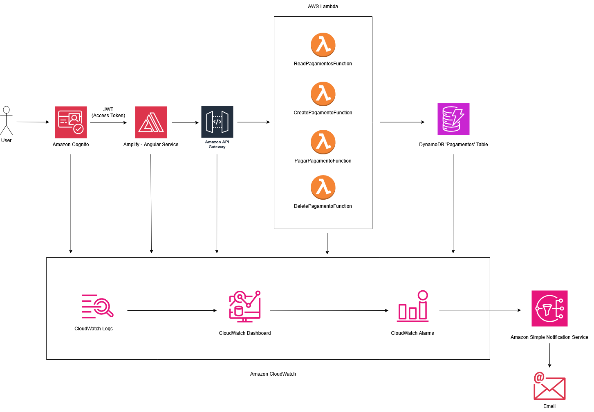
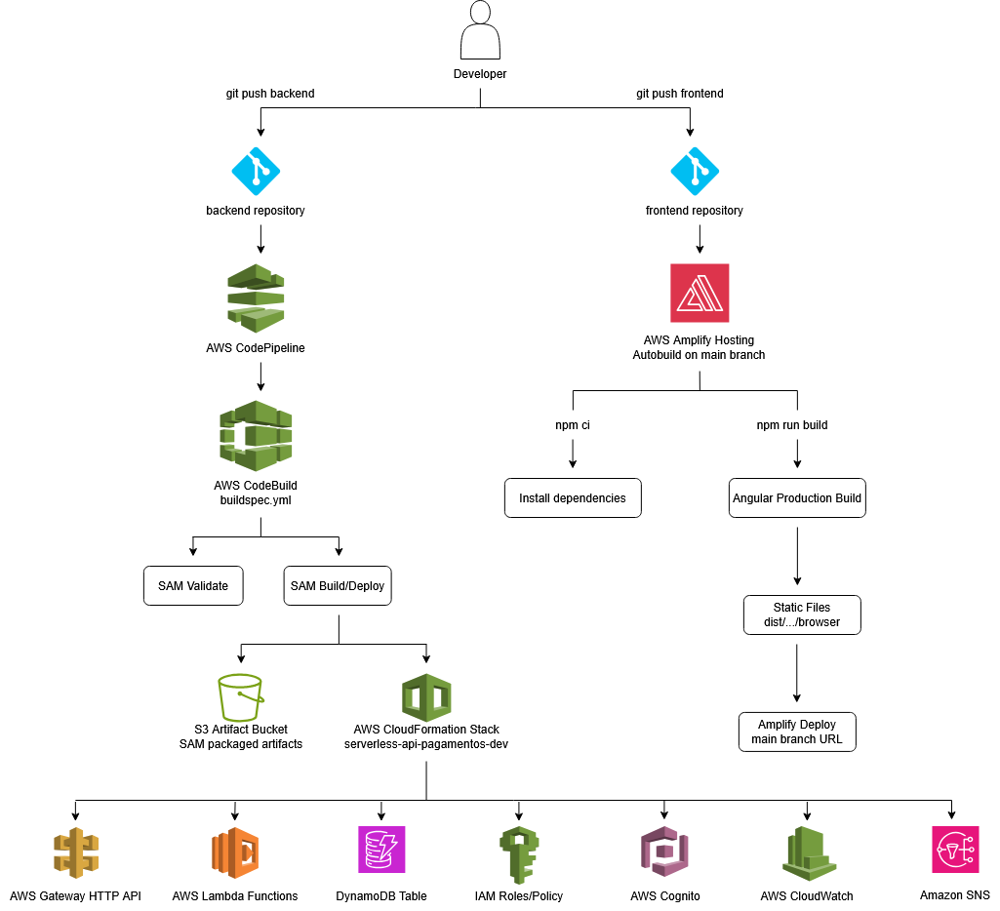

# SAM-Serverless-Architecture-PagamentosApp

A production-oriented serverless payment processing application build entirely on AWS.

--- 

## Project Overview

The **Serverless Payments Application** is a cloud-native application designed to demonstrate how a modern payment processing platform can be built using fully managed AWS services.

Rather than focusing only on implementing CRUD operations, this project aims to showcase how production-grade serverless applications are designed, secured, deployed and monitored following AWS best practices.

The entire infrastructure is provisioned using **AWS SAM (Serverless Application Model)** and **CloudFormation**, allowing every AWS resource to be version-controlled and automatically deployed through a CI/CD pipeline.

The application provides authenticated users with the ability to:

- Create payment processes
- List pending and processed payments
- Process multiple payments
- Delete payments
- Monitor the complete application through CloudWatch dashboards and trigger alarms that notify the developer using email notification.

All requests are authenticated using **Amazon Cognito** and authorized directly by **Amazon API Gateway** through native JWT validation, preventing unauthorized requests from reaching the Lambda functions, reducing unnecessary Lambda invocations, lowering operational costs and improving the overall security posture.

---

## Project Goals

This project was created with the following objectives:

- Learn and apply modern AWS serverless architecture patterns
- Build a secure cloud-native REST API
- Implement Infrastructure as Code using AWS SAM
- Design an automated deployment pipeline
- Implement production-ready monitoring and observability
- Demonstrate AWS Well-Architected Framework best practices
- Build a realistic portfolio project representative of enterprise applications

Although intentionally simple from a business perspective, the project focuses heavily on the operational aspects that are typically expected in production environments.

---

## Key Features

- Fully serverless backend
- Infrastructure as Code (AWS SAM + CloudFormation)
- REST API using Amazon API Gateway (HTTP API)
- Amazon Cognito authentication (OAuth2 Authorization Code + PKCE)
- Native JWT Authorizer
- AWS Lambda business services
- Amazon DynamoDB persistence layer
- CI/CD pipeline using CodePipeline and CodeBuild
- Frontend deployment using AWS Amplify
- CloudWatch structured logging
- CloudWatch operational dashboards
- CloudWatch alarms with Amazon SNS notifications
- Secure HTTPS communication end-to-end

---

## High-Level Architecture

The following diagram illustrates the complete serverless architecture implemented for the **Pagamentos Application**.

The solution follows a cloud-native design where every AWS service has a single responsibility, allowing the application to remain scalable, secure and fully managed.

<p align="center">
  
</p>

The application is composed of four main layers:

| Layer | AWS Service | Responsibility |
|--------|-------------|---------------|
| Authentication | Amazon Cognito | Authenticates users and issues JWT tokens |
| API Layer | Amazon API Gateway | Exposes REST endpoints and validates JWT tokens |
| Business Layer | AWS Lambda | Executes the application's business logic |
| Persistence Layer | Amazon DynamoDB | Stores payment information |
| Observability Layer | AWS CloudWatch and Amazon SNS | Tracks down services logs, set alarms, notifies developers when alarms are triggered |

---

## Request Flow

Every request follows the same execution flow;

1. The user authenticates through Amazon Cognito Hosted UI;
2. Cognito issues an OAuth2 Authorization Code and JWT tokens;
3. The frontend sends the Access Token inside the Authorization header;
4. Amazon API Gateway validates the JWT token before forwarding the request;
5. If the token is invalid, the request is rejected immediately and no Lambda function is executed;
6. If the token is valid, API Gateway routes the request to the corresponding Lambda Function
7. The Lambda executes the business logic;
8. The Lambda interacts with Amazon DynamoDB;
9. The response is returned to the frontend;
10. Frontend is updated with the new data;

Because authentication happens at the API Gateway layer, Lambda functions remain completely focused on business logic, this reduces cost and increase security.

This follows the AWS Well-Architected Framework recommendation of separating security concerns from application code.

---

## Lambda Design

Instead of implementing a single Lambda responsible for every endpoint, the application adopts a **Single Responsibility** approach.

Each business capability is implemented by its own Lambda Function.

| Lambda Function | Responsibility |
|-----------------|---------------|
| ReadPagamentosFunction | Retrieve payments |
| CreatePagamentoFunction | Create new payment processes |
| PagarPagamentosFunction | Process pending payments |
| DeletePagamentoFunction | Delete payment processes |

This design provides several advantages:

- Smaller deployment packages
- Better separation of responsibilities
- Independent scaling
- Easier maintenance
- Reduced blast radius during deployments

---

## Why this Architecture?

The goal of this project was not simply to build a CRUD application, but to explore how a production-oriented serverless application can be designed using AWS managed services.

Every AWS service was selected based on its responsibilities, scalability characteristics and operational benefits for our use case.

### Amazon API Gateway

API Gateway provides a fully managed HTTP interface for the application.

It was selected because it offers:

- Native JWT authentication
- Automatic HTTPS
- Built-in CORS support
- Request routing
- Access logging
- CloudWatch integration

### AWS Lambda

Instead of running a traditional backend server, each business capability is implemented as an independent Lambda function.

This approach provides:

- Automatic scaling
- Pay-per-use pricing
- Independent deployments
- Reduced operational overhead

### Amazon DynamoDB

DynamoDB was selected because the application requires a serverless NoSQL database with predictable low latency and automatic scaling.

Unlike a relational database, there is no infrastructure to provision or maintain using this kind of solution in this scenario.

### Amazon Cognito

Authentication is delegated entirely to Amazon Cognito.

This removes the complexity of implementing:

- Password storage
- Password reset
- MFA
- OAuth2
- OpenID Connect
- JWT generation

### AWS SAM

Infrastructure is managed through Infrastructure as Code.

Every AWS resource—including API Gateway, Lambda functions, Cognito, DynamoDB, CloudWatch dashboards and alarms—is version-controlled and automatically deployed using AWS Serverless Application Model.

### CloudWatch

Operational monitoring is implemented using native CloudWatch metrics, structured logs, dashboards and alarms.

This provides complete visibility into the application's health without requiring third-party monitoring solutions.

---

## Security Architecture

Authentication and authorization are implemented using native AWS services.

Amazon Cognito is responsible for authenticating users and issuing JWT tokens, Amazon API Gateway performs JWT validation before invoking any Lambda function.

This architecture provides several benefits:

- Unauthorized requests never invoke Lambda
- Lower execution cost
- Smaller attack surface
- Less authentication code
- Centralized security model

The backend never validates JWT tokens manually.

Instead, Lambda functions trust API Gateway as the authentication layer and are only executed when JWT tokens are valid.

### IAM and Least Privilege

The project uses AWS SAM Policy Templates to grant DynamoDB permissions to Lambda functions.

Examples include:

- `DynamoDBReadPolicy`
- `DynamoDBWritePolicy`
- `DynamoDBCrudPolicy`

During deployment, CloudFormation generates the required IAM Roles and IAM Policies and attaches them to the correct Lambda functions.

Each function receives only the permissions required to execute its responsibility, following the **Principle of Least Privilege**.

---

## Observability

The application implements a complete monitoring strategy using Amazon CloudWatch.

### API Gateway

API Gateway access logs are enabled and stored in a dedicated CloudWatch Log Group.

The access log format captures useful operational information, including:

- Request ID
- HTTP method
- Route key
- Status code
- Source IP
- User agent
- JWT subject
- JWT username
- Integration latency
- Response latency
- Integration status

### Lambda Functions

Lambda functions produce structured JSON logs to improve troubleshooting and querying through CloudWatch Logs Insights.

The structured logs include:

- Operation name
- Request ID
- Function name
- HTTP method
- Route
- Username
- Status code
- Duration
- Error information

### DynamoDB

DynamoDB is monitored through native CloudWatch metrics, including:

- Consumed Read Capacity Units
- Consumed Write Capacity Units
- Throttled Requests

### Dashboards

A CloudWatch Dashboard is automatically provisioned through AWS SAM.

The dashboard provides a centralized operational view of:

- API Gateway requests and errors
- API Gateway latency
- Lambda invocations
- Lambda errors
- Lambda duration
- Lambda throttles
- DynamoDB capacity usage
- DynamoDB throttled requests

### Alerts

CloudWatch Alarms continuously monitor the infrastructure.

When an alarm threshold is exceeded, the alarm publishes a message to an Amazon SNS topic. The SNS topic currently sends email notifications.

Current notification flow:

```text
CloudWatch Alarm
      ↓
Amazon SNS Topic
      ↓
Email Notification
```

This can evolve into a broader fan-out notification pattern by adding more SNS subscribers such as Lambda, SQS, EventBridge, Slack webhooks, Microsoft Teams, SMS and much more.

---

## Continuous Integration & Continuous Deployment (CI/CD)

The application follows a fully automated deployment strategy.

Backend and frontend are maintained in separate Git repositories and each repository owns its own deployment pipeline.

This separation allows both applications to evolve independently while keeping the deployment process simple and reliable.

Bellow you can see a diagram that represent both deployment pipelines.

<p align="center">
  
</p>


### Why Separate Pipelines?

Backend and frontend deployments intentionally remain independent.

This approach provides several advantages:

- Faster deployments
- Independent release cycles
- Smaller deployment failures
- Easier rollback strategy
- Better separation of responsibilities

For example, a frontend change does not trigger any backend deployment, and infrastructure changes do not rebuild the Angular application.

This reduces deployment time and minimizes operational risk.

### Backend Deployment Pipeline

The backend infrastructure is deployed automatically through **AWS CodePipeline** and **AWS CodeBuild**.

Whenever a commit is pushed to the `main` branch, CodePipeline starts a new deployment.

The pipeline executes in the following steps:

1. Retrieve the latest source code from GitHub.
2. Start an AWS CodeBuild project.
3. Install the required build tools.
4. Validate the AWS SAM template.
5. Build every Lambda function.
6. Package deployment artifacts.
7. Upload packaged artifacts to Amazon S3.
8. Deploy the CloudFormation stack using AWS SAM.

The deployment process is defined in `buildspec.yml`.

Because the infrastructure is managed through Infrastructure as Code, every deployment remains reproducible and version controlled.


### Frontend Deployment Pipeline

The frontend is hosted using **AWS Amplify Hosting**.

Amplify continuously monitors the frontend repository, whenever changes are pushed to the **main** branch, Amplify automatically triggers:

1. Installs project dependencies (`npm ci`)
2. Builds the Angular application
3. Generates the production artifacts
4. Deploys the new version

No manual deployment steps are required, which decreases delivery time.

A frontend change does not trigger a backend deployment, and a backend infrastructure change does not rebuild the frontend.


### Infrastructure as Code

Every backend resource is provisioned through AWS SAM and CloudFormation.

The deployment automatically creates or updates:

- Amazon API Gateway
- AWS Lambda functions
- Amazon DynamoDB table
- Amazon Cognito User Pool
- Cognito App Client
- Cognito Hosted UI Domain
- JWT Authorizer
- IAM Roles and Policies
- CloudWatch Dashboard
- CloudWatch Alarms
- CloudWatch Log Groups
- Amazon SNS Topic

This ensures that the backend environment is reproducible, auditable and version-controlled.


### Deployment Parameters

Environment-specific values are injected into the deployment through CloudFormation parameters.

| Parameter | Description |
|-----------|-------------|
| `AllowedOrigin` | Frontend origin allowed by CORS |
| `FrontendUrl` | Cognito callback and logout URL |
| `CognitoDomainPrefix` | Cognito Hosted UI domain prefix |
| `AlarmNotificationEmail` | Email address used by SNS alarm notifications |

This allows the same template to be reused across environments without ever changing application code.

---

## Local Development

This backend can be executed locally using **AWS SAM CLI** and **DynamoDB Local**.

The local environment emulates the backend flow as closely as possible:

```text
Local API Gateway
      ↓
SAM Local Lambda containers
      ↓
DynamoDB Local container
```

Frontend local development is documented separately in the frontend repository.

### Prerequisites

Install the following tools:

- Java 25
- Maven
- Docker
- AWS CLI
- AWS SAM CLI
- Git

Validate the installation:

```powershell
java -version
mvn -version
docker --version
aws --version
sam --version
```

### Clone the repository

```powershell
git clone https://github.com/sarkosdev/SAM-Serverless-Architecture-PagamentosApp.git
cd SAM-Serverless-Architecture-PagamentosApp
```

### Start DynamoDB Local

Create a Docker network:

```powershell
docker network create sam-local
```

Start DynamoDB Local:

```powershell
docker run -d `
  --name dynamodb-local `
  --network sam-local `
  -p 8000:8000 `
  amazon/dynamodb-local `
  -jar DynamoDBLocal.jar `
  -sharedDb `
  -inMemory
```

DynamoDB Local is available from the host machine at:

```text
http://localhost:8000
```

Inside SAM Lambda containers, it is accessed through:

```text
http://dynamodb-local:8000
```

### Configure Local AWS Dummy Credentials

DynamoDB Local does not require real AWS credentials, but the AWS SDK expects credentials to exist.

```powershell
$env:AWS_ACCESS_KEY_ID="dummy"
$env:AWS_SECRET_ACCESS_KEY="dummy"
$env:AWS_REGION="eu-west-1"
```

### Create the Local DynamoDB Table

```powershell
aws dynamodb create-table `
  --table-name PagamentosTable `
  --attribute-definitions AttributeName=id,AttributeType=S `
  --key-schema AttributeName=id,KeyType=HASH `
  --billing-mode PAY_PER_REQUEST `
  --endpoint-url http://localhost:8000 `
  --region eu-west-1
```

Validate the table:

```powershell
aws dynamodb list-tables `
  --endpoint-url http://localhost:8000 `
  --region eu-west-1
```

Expected output:

```json
{
  "TableNames": [
    "PagamentosTable"
  ]
}
```

### Local Environment Variables

Local Lambda functions use `env.json` to override cloud environment variables.

Example:

```json
{
  "Parameters": {
    "TABLE_NAME": "PagamentosTable",
    "DYNAMODB_ENDPOINT": "http://dynamodb-local:8000",
    "AWS_REGION": "eu-west-1"
  }
}
```

`DYNAMODB_ENDPOINT` is only used locally. In AWS, this variable remains empty and the AWS SDK connects to the real DynamoDB service endpoint.

### Build the Application

```powershell
sam build
```

This compiles the Java Lambda functions and creates the `.aws-sam/build` directory.

If Java code changes, rebuild the application:

```powershell
sam build
```

If `template.yaml` changes, rebuild and restart SAM Local.

### Start the Local API

```powershell
sam local start-api `
  --template .aws-sam/build/template.yaml `
  --env-vars env.json `
  --docker-network sam-local
```

The local API will be available at:

```text
http://127.0.0.1:3000
```

---

## Local Development Notes

- Local DynamoDB uses dummy AWS credentials.
- The local table name is `PagamentosTable`.
- The deployed cloud table name is generated by CloudFormation.
- SAM Local runs Lambda functions inside Docker containers.
- The local API does not represent the full production authentication flow.
- Production authentication is enforced by API Gateway through the Cognito JWT Authorizer.
- Frontend local development is documented separately in the frontend repository *README.md*.

---

## API Reference

All production API requests require a valid Cognito Access Token sent in the `Authorization` header.

```http
Authorization: Bearer <access_token>
```

### Endpoints

| Method | Endpoint | Description |
|--------|----------|-------------|
| `GET` | `/pagamentos` | List all payments |
| `GET` | `/pagamentos/{id}` | Retrieve a payment by id |
| `GET` | `/pagamentos/status/{status}` | List payments by status |
| `POST` | `/pagamentos` | Create a new payment process |
| `POST` | `/pagamentos/pagar` | Process pending payments |
| `DELETE` | `/pagamentos/{id}` | Delete payment by id |
| `DELETE` | `/pagamentos/process/{processNum}` | Delete payment by process number |

### Payment Status

Supported values:

- `PENDING`
- `PAGO`

### Create Payment

```http
POST /pagamentos
Content-Type: application/json
Authorization: Bearer <access_token>
```

Request:

```json
{
  "processNum": "PROC-001",
  "processValue": "25.50"
}
```

### Process Payments

```http
POST /pagamentos/pagar
Content-Type: application/json
Authorization: Bearer <access_token>
```

Request:

```json
{
  "listaProcess": [
    "PROC-001",
    "PROC-002"
  ]
}
```

### Common Status Codes

| Status Code | Meaning |
|-------------|---------|
| `200` | Request completed successfully |
| `201` | Resource created successfully |
| `400` | Invalid request |
| `401` | Missing or invalid JWT token |
| `404` | Resource not found |
| `500` | Internal server error |

---

## Useful Commands

### Validate the SAM template

```powershell
sam validate --template-file template.yaml --region eu-west-1
```

### Compile Lambda functions
```powershell
mvn clean install -DskipTests
```

### Build the SAM application

```powershell
sam build
```

### Start the local API

```powershell
sam local start-api `
  --template .aws-sam/build/template.yaml `
  --env-vars env.json `
  --docker-network sam-local
```

### Scan DynamoDB Local

```powershell
aws dynamodb scan `
  --table-name PagamentosTable `
  --endpoint-url http://localhost:8000 `
  --region eu-west-1
```

### Count items in DynamoDB Local

```powershell
aws dynamodb scan `
  --table-name PagamentosTable `
  --select COUNT `
  --endpoint-url http://localhost:8000 `
  --region eu-west-1
```

### Remove DynamoDB Local container

```powershell
docker rm -f dynamodb-local
```

### Check CloudFormation outputs

```powershell
aws cloudformation describe-stacks `
  --stack-name serverless-api-pagamentos-dev `
  --region eu-west-1 `
  --query "Stacks[0].Outputs"
```

### Test SNS alarm notification manually

```powershell
aws cloudwatch set-alarm-state `
  --alarm-name "serverless-api-pagamentos-dev-api-gateway-5xx" `
  --state-value ALARM `
  --state-reason "Manual test of alarm notification" `
  --region eu-west-1
```

Return the alarm to OK:

```powershell
aws cloudwatch set-alarm-state `
  --alarm-name "serverless-api-pagamentos-dev-api-gateway-5xx" `
  --state-value OK `
  --state-reason "Manual test completed" `
  --region eu-west-1
```
---


## Future Improvements

Potential improvements for future iterations:

- Add Cognito groups for role-based access control
- Add API Gateway request validation
- Add custom domain names for frontend and backend
- Add WAF protection in front of API Gateway
- Add X-Ray distributed tracing
- Add automated integration tests in the pipeline
- Add separate environments for dev, staging and production
- Replace broad SAM policy templates with fully custom IAM policies
- Add DynamoDB Global Secondary Indexes if new access patterns require them
- Add dead-letter queues for asynchronous workloads if introduced later

---

## Repository Notes

This repository contains the backend implementation only.

The frontend Angular application is maintained in a separate repository and has its own README covering:

- Angular project structure
- Cognito integration in the frontend
- Auth guards and interceptors
- Local proxy configuration
- Amplify Hosting deployment

---

## License

This project is intended for learning, portfolio and architectural demonstration purposes.

**Nuno Cruz, 07/09/2026**